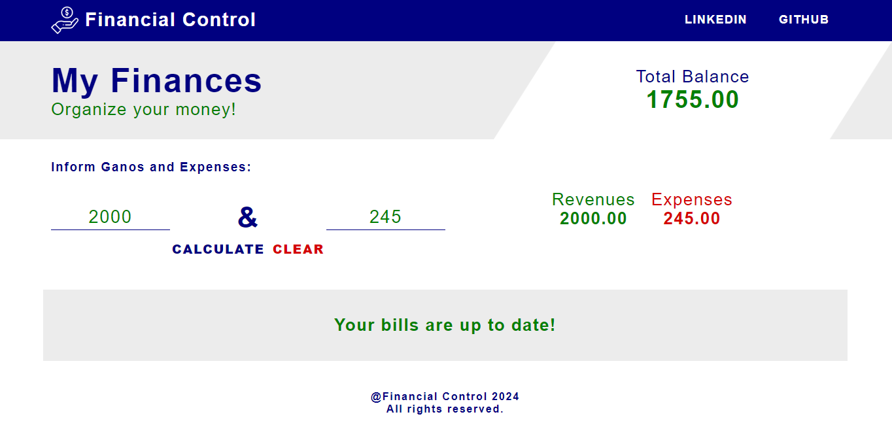
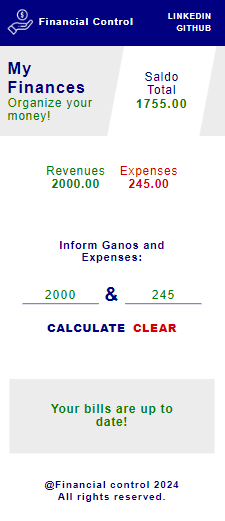

# **Financial Control**

## Sobre o projeto

Clique e acesse o projeto: [finances-react](https://react-js-finances.vercel.app/)

Trabalho realizado com o framework React Js, com uso de TypeScript, HTML5, CSS3 e Flexbox. 

Quer organizar suas finanças? Basta informar seus ganhos totais e suas despesas totais e o aplicativo fará o cálculo lhe ajudando a organizar melhor o seu dinheiro. Caso o valor seja positivo ou negativo, você será informado com uma mensagem.

O objetivo é mostrar o uso de classe, interface e react hooks com a linguagem TypeScript e React.  

Trabalhei com componentes de cabeçalho, de rodapé e de conteúdo; dividindo as responsabilidades.

 

Work carried out with the React Js framework, using TypeScript, HTML5, CSS3 and Flexbox.

Do you want to organize your finances? Just enter your total earnings and your total expenses and the application will do the calculation, helping you to better organize your money. If the value is positive or negative, you will be informed with a message.

The objective is to show the use of classes, interfaces and react hooks with the TypeScript and React languages.

I worked with header, footer and content components; dividing responsibilities.

## Layout Mobile

## Tecnologias Utilizadas

* HTML5
* CSS3
* Flexbox
* Typescript
* React Js

## Instalação

##### Instalar Dependências
<pre><code>npm install</code></pre>

##### Executar Aplicação
<pre><code>npm run dev</code></pre>

## Autor

#### **Katarine Albuquerque**

    
    &nbsp;
    

